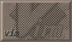

<!DOCTYPE html>
<html>
<head>
  <meta charset="UTF-8">
  <meta name="viewport" content="width=device-width, initial-scale=1.0">
  <title>./arf.sh</title>
  <link href="style.css" rel="stylesheet" type="text/css" media="all">
</head>
<body>

  <h1>max's repo!</h1>
  

  <section>
    <nav>
      <ul>
        <li><a href="https://p4w.neocities.org">my website</a></li>
      </ul>
    </nav>
  </section>

  <article>
    <h2>About this repo</h2>
    
i'll mostly try to upload my tweaks here just so it can be much more comfortable for everyone

    
if you don't know what this is, it's a repo for sileo
 
    <li><a href="sileo://source/https://pawxed.github.io/repo">add this repo in sileo</a></li>
    <h2>About my tweaks</h2>
    
to be fair, i only make my tweaks whenever I felt like it so.. maybe more tweaks coming soon?
 
  </article>
    

 

  

    
  

  

    
  

  

    
  

 
<footer>
  &copy; 2025 max. All rights reserved.
</footer>
<footer>
  Last updated: 26/08/26
</footer>
  

</body>
</html>
